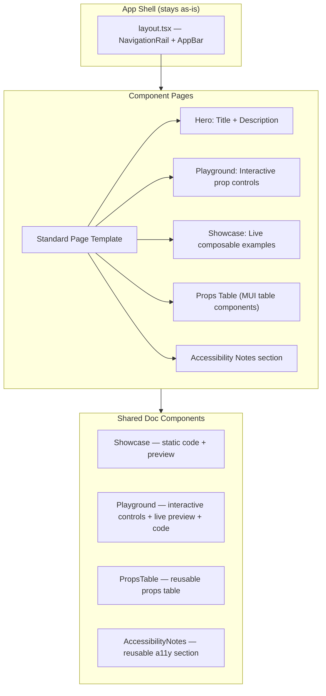
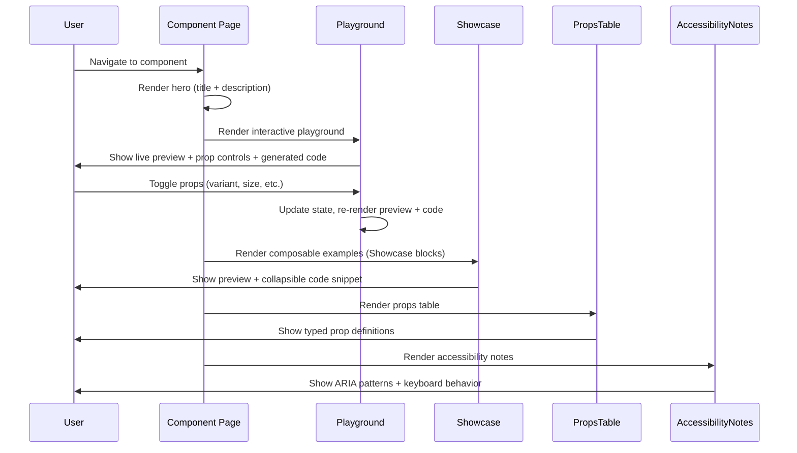
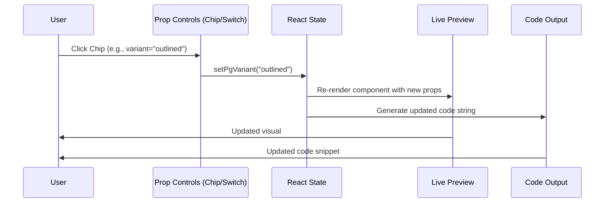

# Design Document: Docs Site Rebuild

## Overview

The `@strata/mui` docs site is a Next.js App Router site that documents the M3 Expressive component library. The rebuild standardizes all component pages to exclusively use the composable compound component API (for components that support it), removes all legacy prop-based examples, ensures the entire site is built with MUI components (no raw HTML or third-party UI libraries for UI elements), and adds interactive playgrounds plus accessibility notes to every component page.

The site shell (NavigationRail, AppBar, layout) already uses MUI components and stays as-is. The work focuses on updating compound-component pages (AppBar, NavigationBar, Search, BottomSheet, SideSheet, FABMenu) and establishing a consistent page template that every component page follows: description, live examples via `Showcase`, interactive playground via `Playground`, props table, and accessibility notes.

## Architecture



## Sequence Diagrams

### Component Page Render Flow



### Playground Interaction Flow



## Components and Interfaces

### Component 1: PropsTable

**Purpose**: Reusable component that renders a typed props table for any component. Built entirely with MUI components (no raw HTML tables).

```typescript
interface PropDefinition {
  name: string;
  type: string;
  default?: string;
  description: string;
  required?: boolean;
}

interface PropsTableProps {
  /** Component name shown as header */
  componentName: string;
  /** Array of prop definitions */
  props: PropDefinition[];
}

function PropsTable({ componentName, props }: PropsTableProps): JSX.Element;
```

**Responsibilities**:
- Renders a styled table with Prop, Type, Default, Description columns
- Uses MUI surface containers and outline-variant borders for styling
- Highlights required props
- Monospace font for prop names and types

### Component 2: AccessibilityNotes

**Purpose**: Reusable section component that displays accessibility information for a component.

```typescript
interface A11yNote {
  /** Category: keyboard, aria, screen-reader, focus */
  category: "keyboard" | "aria" | "screen-reader" | "focus";
  /** Description of the accessibility behavior */
  description: string;
}

interface AccessibilityNotesProps {
  /** Component name */
  componentName: string;
  /** List of accessibility notes */
  notes: A11yNote[];
}

function AccessibilityNotes({ componentName, notes }: AccessibilityNotesProps): JSX.Element;
```

**Responsibilities**:
- Groups notes by category with Icon indicators
- Uses Card/CardContent for the container
- Renders keyboard shortcuts in monospace Chips

### Component 3: Showcase (existing — no changes needed)

Already built with MUI components (IconButton, Icon). Provides static code examples with copy button and expandable code view.

### Component 4: Playground (existing — no changes needed)

Already built with MUI components. Provides interactive prop controls with live preview and generated code output.

## Data Models

### Page Structure Model

Each component page follows this standard template structure:

```typescript
interface ComponentPageStructure {
  hero: {
    title: string;            // Component name
    description: string;      // 1-2 sentence M3 description
  };
  playground: {
    controls: PlaygroundControl[];  // Interactive prop toggles
    defaultProps: Record<string, unknown>;
    codeTemplate: (props: Record<string, unknown>) => string;
  };
  examples: {
    title: string;
    showcase: ShowcaseConfig[];    // Live examples using Showcase
  };
  propsTable: PropDefinition[];
  accessibility: A11yNote[];
}

interface PlaygroundControl {
  type: "chips" | "switch" | "select";
  propName: string;
  label: string;
  options?: string[];   // For chips/select
}
```

### Compound Component Page Update Pattern

For pages that need updating (removing legacy, keeping only composable):

```typescript
// BEFORE (legacy prop-based — TO REMOVE)
<AppBar
  leadingIcon={<IconButton icon="menu" />}
  headline="Title"
  trailingIcons={<IconButton icon="search" />}
/>

// AFTER (composable — TO KEEP)
<AppBar elevated>
  <AppBar.Leading>
    <IconButton variant="standard" aria-label="Menu">
      <Icon name="menu" />
    </IconButton>
  </AppBar.Leading>
  <AppBar.Headline>Title</AppBar.Headline>
  <AppBar.Trailing>
    <IconButton variant="standard" aria-label="Search">
      <Icon name="search" />
    </IconButton>
  </AppBar.Trailing>
</AppBar>
```

## Key Functions with Formal Specifications

### Function 1: generatePlaygroundCode()

```typescript
function generatePlaygroundCode(
  componentName: string,
  props: Record<string, unknown>,
  children?: string
): string;
```

**Preconditions:**
- `componentName` is a valid component name from the library
- `props` contains only valid prop key/value pairs for the component
- Boolean props with value `false` are omitted from output

**Postconditions:**
- Returns a valid JSX code string
- String props are quoted, boolean `true` props are shorthand
- Children are properly indented
- Output can be directly pasted into a React file

### Function 2: Component Page Template Pattern

```typescript
// Standard page structure for all component pages
function ComponentPage(): JSX.Element {
  // 1. Playground state hooks
  const [propState, setPropState] = useState(defaults);

  // 2. Generated code string
  const code = generatePlaygroundCode("Component", propState);

  return (
    <div className="max-w-4xl space-y-8">
      {/* Hero */}
      <div>
        <h1>Component Name</h1>
        <p>Description</p>
      </div>

      {/* Playground */}
      <Playground title="Playground" code={code} controls={...}>
        <Component {...propState} />
      </Playground>

      {/* Examples */}
      <section>
        <h2>Example Category</h2>
        <Showcase title="..." code={...}>
          {/* Live composable example */}
        </Showcase>
      </section>

      {/* Props Table */}
      <PropsTable componentName="..." props={[...]} />

      {/* Accessibility */}
      <AccessibilityNotes componentName="..." notes={[...]} />
    </div>
  );
}
```

## Algorithmic Pseudocode

### Page Update Algorithm (for compound component pages)

```pascal
ALGORITHM updateCompoundComponentPage(page)
INPUT: page — existing component page file
OUTPUT: updated page with only composable examples

BEGIN
  // Step 1: Identify all code examples in the page
  examples ← findAllShowcaseBlocks(page)
  
  FOR each example IN examples DO
    // Step 2: Check if example uses legacy prop-based API
    IF usesLegacyAPI(example) THEN
      REMOVE example from page
    ELSE IF usesComposableAPI(example) THEN
      KEEP example (already correct)
    END IF
  END FOR
  
  // Step 3: Add Playground section if not present
  IF NOT hasPlayground(page) THEN
    playground ← createPlayground(page.componentName, page.composableProps)
    INSERT playground AFTER hero section
  END IF
  
  // Step 4: Add PropsTable if not present
  IF NOT hasPropsTable(page) THEN
    propsTable ← createPropsTable(page.componentName, page.propDefinitions)
    INSERT propsTable AFTER examples section
  END IF
  
  // Step 5: Add Accessibility notes if not present
  IF NOT hasAccessibilityNotes(page) THEN
    a11y ← createAccessibilityNotes(page.componentName, page.a11yPatterns)
    INSERT a11y AFTER propsTable
  END IF
  
  RETURN page
END
```

### Legacy API Detection

```pascal
ALGORITHM usesLegacyAPI(example)
INPUT: example — a Showcase code block
OUTPUT: boolean

BEGIN
  // Legacy patterns for each component:
  // AppBar: uses leadingIcon=, headline=, trailingIcons= props
  // NavigationBar: uses items= array prop
  // Search: uses leadingIcon=, trailingIcon= string props (not children)
  // BottomSheet: uses showDragHandle= without sub-components
  // SideSheet: uses headline=, showClose=, actions= props without sub-components
  // FABMenu: uses items= array prop
  
  legacyPatterns ← [
    "leadingIcon={", "headline={", "trailingIcons={",  // AppBar legacy
    "items={[",                                         // NavigationBar/FABMenu legacy
    'leadingIcon="', 'trailingIcon={',                  // Search legacy (string prop)
    "showDragHandle={",                                 // BottomSheet legacy
    'headline="', "actions={",                          // SideSheet legacy
  ]
  
  FOR each pattern IN legacyPatterns DO
    IF example.code CONTAINS pattern THEN
      // Verify it's actually legacy (not a sub-component prop)
      IF NOT hasCompoundSubComponents(example) THEN
        RETURN true
      END IF
    END IF
  END FOR
  
  RETURN false
END
```

## Example Usage

### Updated AppBar Page (composable only)

```typescript
"use client";

import * as React from "react";
import { AppBar, IconButton, Icon, Chip, Switch } from "@mui/index";
import { Showcase, Playground } from "@/components/showcase";
import { PropsTable } from "@/components/props-table";
import { AccessibilityNotes } from "@/components/accessibility-notes";

export default function AppBarPage() {
  // Playground state
  const [elevated, setElevated] = React.useState(false);
  const [centered, setCentered] = React.useState(false);
  const [showSubtitle, setShowSubtitle] = React.useState(false);

  const playgroundCode = `<AppBar${elevated ? " elevated" : ""}${centered ? " centered" : ""}>
  <AppBar.Leading>
    <IconButton variant="standard" aria-label="Menu">
      <Icon name="menu" />
    </IconButton>
  </AppBar.Leading>
  <AppBar.Headline${showSubtitle ? ' subtitle="3 messages"' : ""}>Page Title</AppBar.Headline>
  <AppBar.Trailing>
    <IconButton variant="standard" aria-label="Search">
      <Icon name="search" />
    </IconButton>
  </AppBar.Trailing>
</AppBar>`;

  return (
    <div className="max-w-4xl space-y-8">
      {/* Hero */}
      <div>
        <h1 className="text-[28px] leading-9 font-normal text-surface-foreground mb-2">
          App Bar
        </h1>
        <p className="text-[16px] leading-6 text-surface-variant-foreground">
          Top app bars display information and actions at the top of a screen.
        </p>
      </div>

      {/* Playground */}
      <Playground
        title="Playground"
        code={playgroundCode}
        controls={
          <>
            <div className="space-y-3">
              <label className="flex items-center justify-between cursor-pointer">
                <span className="text-[13px] text-surface-foreground">Elevated</span>
                <Switch checked={elevated} onCheckedChange={setElevated} />
              </label>
              <label className="flex items-center justify-between cursor-pointer">
                <span className="text-[13px] text-surface-foreground">Centered</span>
                <Switch checked={centered} onCheckedChange={setCentered} />
              </label>
              <label className="flex items-center justify-between cursor-pointer">
                <span className="text-[13px] text-surface-foreground">Subtitle</span>
                <Switch checked={showSubtitle} onCheckedChange={setShowSubtitle} />
              </label>
            </div>
          </>
        }
      >
        <AppBar elevated={elevated} centered={centered} className="relative! w-full">
          <AppBar.Leading>
            <IconButton variant="standard" aria-label="Menu">
              <Icon name="menu" />
            </IconButton>
          </AppBar.Leading>
          <AppBar.Headline subtitle={showSubtitle ? "3 messages" : undefined}>
            Page Title
          </AppBar.Headline>
          <AppBar.Trailing>
            <IconButton variant="standard" aria-label="Search">
              <Icon name="search" />
            </IconButton>
          </AppBar.Trailing>
        </AppBar>
      </Playground>

      {/* Composable Examples */}
      <section className="space-y-4">
        <h2 className="text-[22px] leading-7 font-normal">Navigation & Actions</h2>
        <Showcase
          title="Navigation & Actions"
          className="flex-col items-stretch"
          code={`<AppBar elevated>\n  <AppBar.Leading>...</AppBar.Leading>\n  <AppBar.Headline subtitle="3 new messages">Inbox</AppBar.Headline>\n  <AppBar.Trailing>...</AppBar.Trailing>\n</AppBar>`}
        >
          {/* Live composable example */}
        </Showcase>
      </section>

      {/* Props Table */}
      <PropsTable
        componentName="AppBar"
        props={[
          { name: "elevated", type: "boolean", default: "false", description: "Adds scroll elevation styling" },
          { name: "centered", type: "boolean", default: "false", description: "Center-aligns the headline" },
          { name: "children", type: "ReactNode", description: "AppBar.Leading, AppBar.Headline, AppBar.Trailing", required: true },
        ]}
      />

      {/* Accessibility */}
      <AccessibilityNotes
        componentName="AppBar"
        notes={[
          { category: "aria", description: "Uses role=\"banner\" for landmark navigation" },
          { category: "keyboard", description: "All action buttons are focusable with Tab" },
          { category: "screen-reader", description: "Headline is rendered as <h1> for proper heading hierarchy" },
        ]}
      />
    </div>
  );
}
```

### Updated NavigationBar Page (composable only)

```typescript
// Only shows NavigationBar.Item composable pattern
<NavigationBar value={active} onValueChange={setActive}>
  <NavigationBar.Item value="home" icon="home" label="Home" />
  <NavigationBar.Item value="search" icon="search" label="Search" />
  <NavigationBar.Item value="profile" icon="person" label="Profile" />
</NavigationBar>

// NO items={[...]} array prop examples
```

### Updated Search Page (composable only)

```typescript
// Only shows Search sub-component pattern
<Search value={query} onValueChange={setQuery}>
  <Search.LeadingIcon>
    <Icon name="search" size={24} />
  </Search.LeadingIcon>
  <Search.Input placeholder="Search items..." />
  <Search.TrailingIcon>
    <IconButton variant="standard" size="xs" aria-label="Voice search">
      <Icon name="mic" />
    </IconButton>
  </Search.TrailingIcon>
</Search>

// NO leadingIcon="search" / trailingIcon={...} prop examples
```

### Updated BottomSheet Page (composable only)

```typescript
// Only shows BottomSheet sub-component pattern
<BottomSheet open={open} onOpenChange={setOpen}>
  <BottomSheet.Handle />
  <BottomSheet.Header>
    <h2>Title</h2>
  </BottomSheet.Header>
  <BottomSheet.Content>
    <p>Content goes here</p>
  </BottomSheet.Content>
  <BottomSheet.Actions>
    <Button variant="outlined">Cancel</Button>
    <Button variant="filled">Confirm</Button>
  </BottomSheet.Actions>
</BottomSheet>

// NO showDragHandle={true} + raw children pattern
```

### Updated SideSheet Page (composable only)

```typescript
// Only shows SideSheet sub-component pattern
<SideSheet open={open} onOpenChange={setOpen} side="right">
  <SideSheet.Header headline="Filters" showClose />
  <SideSheet.Content>
    <p>Filter options</p>
  </SideSheet.Content>
  <SideSheet.Actions>
    <Button variant="outlined">Reset</Button>
    <Button variant="filled">Apply</Button>
  </SideSheet.Actions>
</SideSheet>

// NO headline="..." / actions={...} prop-based pattern
```

### Updated FABMenu Section (composable only)

```typescript
// Only shows FABMenu.Item composable pattern
<FABMenu triggerIcon={<Icon name="add" />} triggerLabel="Actions">
  <FABMenu.Item icon={<Icon name="edit" />} label="Edit" onClick={handleEdit} />
  <FABMenu.Item icon={<Icon name="share" />} label="Share" onClick={handleShare} />
  <FABMenu.Item icon={<Icon name="delete" />} label="Delete" onClick={handleDelete} />
</FABMenu>

// NO items={[{ icon, label, onClick }]} array prop examples
// NOTE: FAB and ExtendedFAB remain prop-based (atomic components)
```

## Correctness Properties

1. **No legacy API in compound component pages**: ∀ page ∈ {AppBar, NavigationBar, Search, BottomSheet, SideSheet, FABMenu pages}: page contains zero instances of legacy prop patterns (`items={[`, `leadingIcon={`, `headline={` as root props, `trailingIcons={`, `showDragHandle={`, `actions={` as root props)

2. **All UI built with MUI components**: ∀ page ∈ docs site: page imports UI elements exclusively from `@mui/index` or shared doc components (`@/components/*`). No `<table>`, `<select>`, or third-party UI component imports.

3. **Every component page has required sections**: ∀ page ∈ component pages: page contains (hero section) ∧ (≥1 Showcase or Playground) ∧ (PropsTable) ∧ (AccessibilityNotes)

4. **Playground generates valid code**: ∀ state combination in Playground: `generatePlaygroundCode(component, state)` produces syntactically valid JSX that renders without error

5. **Atomic components remain prop-based**: ∀ page ∈ {Button, IconButton, FAB, ExtendedFAB, TextField, Checkbox, ...}: page uses direct prop-based API (these are atomic, not compound components)

6. **Site shell unchanged**: layout.tsx NavigationRail + AppBar structure remains intact; no regression in navigation

## Error Handling

### Error Scenario 1: Missing Component Import

**Condition**: A page references a component not exported from `@mui/index`
**Response**: TypeScript compilation error caught at build time
**Recovery**: Add missing export to library index

### Error Scenario 2: Playground State Mismatch

**Condition**: Playground generates code for a prop combination the component doesn't support
**Response**: Component renders with default/fallback behavior; no crash
**Recovery**: Playground controls should only offer valid combinations via constrained control options

### Error Scenario 3: Showcase Code Doesn't Match Preview

**Condition**: The `code` string prop diverges from the actual rendered children
**Response**: Visual preview shows real behavior; code may be stale
**Recovery**: Generate code strings from the same state/props used to render the preview component

## Testing Strategy

### Build Verification

- `next build` must succeed with zero TypeScript errors
- All pages render without React runtime errors (no broken Context errors from misusing compound components)

### Visual Regression

- Verify each updated page renders correctly in both light and dark themes
- Verify Playground prop toggles update the preview in real-time

### Content Audit

- Grep across all compound-component pages to confirm zero legacy API patterns remain
- Verify every component page has: hero, examples, props table, accessibility notes

### Property-Based Testing Approach

**Property Test Library**: Not applicable (this is a docs-only change with no runtime logic to property-test)

### Accessibility Testing

- Each page's AccessibilityNotes must accurately reflect the component's actual ARIA implementation
- Tab through each Playground to verify keyboard-only operation works

## Performance Considerations

- Playground components use local React state only — no expensive re-renders
- Showcase code blocks are lazy-revealed (collapsed by default) to reduce initial paint
- No additional dependencies introduced; all UI from existing `@mui/index` exports

## Security Considerations

- No user-generated content; all examples are hardcoded
- `navigator.clipboard.writeText` (copy button) requires secure context (HTTPS) — already handled

## Dependencies

- `@mui/index` — the component library being documented (already installed)
- `next` — App Router framework (already installed)
- `material-symbols` — icon font (already installed)
- No new dependencies required
