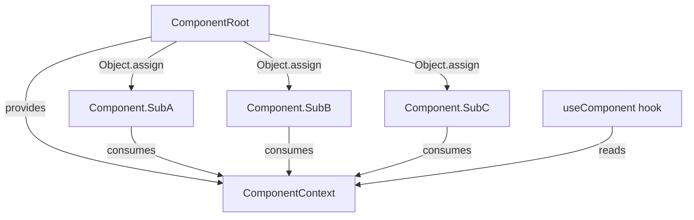

# Design Document: M3 Composable Components

## Overview

This design refactors and enhances MUI components to use composable compound component patterns where M3 anatomy defines multiple content slots. The architecture follows the existing `NavigationRail` reference pattern: `Object.assign` for namespace exports, React Context for shared state, and `forwardRef` on all DOM-rendering sub-components.

**Scope:**
- **New compound refactors:** AppBar, NavigationBar, BottomSheet, SideSheet, Search
- **Composable enhancements (additive):** FABMenu, SplitButton
- **Verification only (already compound):** Card, Dialog, Toolbar, Tabs, Menu, ButtonGroup, List, Snackbar

**Key design decision:** Components that are already compound (Card, Dialog, Toolbar, Tabs, etc.) receive verification and gap documentation only — no structural changes unless gaps are found. Simple atomic components remain data-driven.

## Architecture

### Compound Component Pattern

All compound components follow a single consistent pattern derived from `NavigationRail`:



**Pattern rules:**
1. Root component creates a Context Provider with shared state
2. Sub-components are attached via `Object.assign(RootComponent, { SubA, SubB, SubC })`
3. Each sub-component calls `useComponentContext()` internally (throws if outside provider)
4. A public `useComponentName()` hook is exported for advanced use cases
5. All sub-components accept `className`, `children`, and forward `ref`
6. Existing prop-based API is preserved as a fallback (detected by absence of compound children)

### State Management Pattern

Components with selectable/active state use the controlled/uncontrolled pattern:

```typescript
interface RootProps {
  value?: string;              // Controlled
  defaultValue?: string;       // Uncontrolled initial
  onValueChange?: (v: string) => void;  // Change callback
}
```

### Detection Strategy for Dual API

Components supporting both prop-based and composable APIs detect which mode to use:

```typescript
// Inside root component render:
const hasCompoundChildren = React.Children.toArray(children).some(
  child => React.isValidElement(child) && isCompoundSubComponent(child)
);

if (hasCompoundChildren) {
  // Render composable layout
} else {
  // Render legacy prop-based layout
}
```

## Components and Interfaces

### 1. AppBar (Compound Refactor)

**Current API:** Prop-based with `leadingIcon`, `headline`, `subtitle`, `trailingIcons` props.

**New Compound API:**

```tsx
// Usage
<AppBar elevated>
  <AppBar.Leading>
    <IconButton icon="menu" />
  </AppBar.Leading>
  <AppBar.Headline subtitle="Subtitle text">
    Page Title
  </AppBar.Headline>
  <AppBar.Trailing>
    <IconButton icon="search" />
    <IconButton icon="more_vert" />
  </AppBar.Trailing>
</AppBar>
```

**Sub-components:**

| Sub-component | Role | Props |
|---|---|---|
| `AppBar` (root) | Container, 64dp height, surface bg | `elevated`, `centered`, `className`, `children` |
| `AppBar.Leading` | Leading icon slot, 48dp touch target | `className`, `children` |
| `AppBar.Headline` | Title area, flex-1 | `subtitle`, `className`, `children` |
| `AppBar.Trailing` | Trailing actions slot | `className`, `children` |

**Context:** `AppBarContext` shares `{ elevated, centered }` so sub-components can adjust styling.

**Backward compatibility:** When children are not recognized sub-components, falls back to `children` rendered in headline area (existing behavior). The old `leadingIcon`/`headline`/`trailingIcons` props remain supported — if these props are provided AND no compound children are detected, the old render path is used.

**File:** `mui/src/app-bar.tsx` (modified in place)

---

### 2. NavigationBar (Compound Refactor)

**Current API:** Data-driven `items` array with `NavigationBarItem` objects.

**New Compound API:**

```tsx
<NavigationBar value={active} onValueChange={setActive}>
  <NavigationBar.Item value="home" icon="home" activeIcon="home" label="Home" />
  <NavigationBar.Item value="search" icon="search" label="Search" badge="dot" />
  <NavigationBar.Item value="profile" icon="person" label="Profile" badge={3} />
</NavigationBar>
```

**Sub-components:**

| Sub-component | Role | Props |
|---|---|---|
| `NavigationBar` (root) | Fixed bottom bar, 64dp | `value`, `defaultValue`, `onValueChange`, `className`, `children` |
| `NavigationBar.Item` | Individual nav item | `value`, `icon`, `activeIcon`, `label`, `badge`, `className`, `children` |

**Context:** `NavigationBarContext` shares `{ activeValue, onSelect }`.

**Backward compatibility:** The old `items` array prop is still supported. If `items` is provided, the data-driven render path is used. If children are `NavigationBar.Item` elements, the composable path is used.

**File:** `mui/src/navigation/navigation-bar.tsx` (modified in place)

---

### 3. BottomSheet (Compound Refactor)

**Current API:** Monolithic component with `open`, `onOpenChange`, `variant`, `showDragHandle`, and `children`.

**New Compound API:**

```tsx
<BottomSheet open={open} onOpenChange={setOpen} variant="modal">
  <BottomSheet.Handle />
  <BottomSheet.Header>
    <h2>Sheet Title</h2>
  </BottomSheet.Header>
  <BottomSheet.Content>
    <p>Sheet body content</p>
  </BottomSheet.Content>
  <BottomSheet.Actions>
    <Button>Cancel</Button>
    <Button variant="filled">Confirm</Button>
  </BottomSheet.Actions>
</BottomSheet>
```

**Sub-components:**

| Sub-component | Role | Props |
|---|---|---|
| `BottomSheet` (root) | Overlay container, manages open/close | `open`, `onOpenChange`, `variant`, `className`, `children` |
| `BottomSheet.Handle` | Drag handle pill (32×4dp) | `className` |
| `BottomSheet.Header` | Header section | `className`, `children` |
| `BottomSheet.Content` | Scrollable content area | `className`, `children` |
| `BottomSheet.Actions` | Bottom action buttons | `className`, `children` |

**Context:** `BottomSheetContext` shares `{ open, onOpenChange, variant }`.

**Backward compatibility:** When children are not recognized sub-components (no `.Handle`, `.Header`, etc.), renders with the existing layout (drag handle based on `showDragHandle` prop, children in content area). The `showDragHandle` prop is deprecated in favor of including/excluding `BottomSheet.Handle`.

**File:** `mui/src/sheets/bottom-sheet.tsx` (modified in place)

---

### 4. SideSheet (Compound Refactor)

**Current API:** Prop-based with `headline`, `showClose`, `actions`, and `children`.

**New Compound API:**

```tsx
<SideSheet open={open} onOpenChange={setOpen} variant="modal" side="right">
  <SideSheet.Header headline="Filter Options" showClose />
  <SideSheet.Content>
    <p>Filter controls here</p>
  </SideSheet.Content>
  <SideSheet.Actions>
    <Button>Reset</Button>
    <Button variant="filled">Apply</Button>
  </SideSheet.Actions>
</SideSheet>
```

**Sub-components:**

| Sub-component | Role | Props |
|---|---|---|
| `SideSheet` (root) | Overlay container, slide animation | `open`, `onOpenChange`, `variant`, `side`, `className`, `children` |
| `SideSheet.Header` | Header with optional close button | `headline`, `showClose`, `className`, `children` |
| `SideSheet.Content` | Scrollable content area | `className`, `children` |
| `SideSheet.Actions` | Bottom action bar (72dp) | `className`, `children` |

**Context:** `SideSheetContext` shares `{ open, onOpenChange, variant, side }`.

**Backward compatibility:** Old `headline`, `showClose`, and `actions` props on root are still supported. If no compound children are detected, uses the legacy render path.

**File:** `mui/src/sheets/side-sheet.tsx` (modified in place)

---

### 5. Search (Compound Refactor)

**Current API:** Prop-based with `leadingIcon`, `trailingIcon`, `value`, `onValueChange`, etc.

**New Compound API:**

```tsx
<Search value={query} onValueChange={setQuery}>
  <Search.LeadingIcon>
    <Icon name="search" size={24} />
  </Search.LeadingIcon>
  <Search.Input placeholder="Search items..." />
  <Search.TrailingIcon>
    <IconButton icon="mic" size="s" />
  </Search.TrailingIcon>
</Search>
```

**Sub-components:**

| Sub-component | Role | Props |
|---|---|---|
| `Search` (root) | Container, 56dp pill | `value`, `defaultValue`, `onValueChange`, `className`, `children` |
| `Search.LeadingIcon` | Leading icon slot (48dp target) | `className`, `children` |
| `Search.Input` | Text input element | `placeholder`, `disabled`, `aria-label`, `className` |
| `Search.TrailingIcon` | Trailing icon slot (48dp target) | `className`, `children` |

**Context:** `SearchContext` shares `{ value, onValueChange, isFocused, setFocused, disabled }`.

**Backward compatibility:** When no compound children are present, the old prop-based API (`leadingIcon`, `trailingIcon`, `placeholder`, etc.) is used unchanged.

**File:** `mui/src/search.tsx` (modified in place)

---

### 6. FABMenu (Composable Enhancement)

**Current API (preserved):** Data-driven `items` array.

**New Optional Composable API:**

```tsx
<FABMenu triggerIcon={<Icon name="add" />} triggerLabel="Actions">
  <FABMenu.Item icon={<Icon name="edit" />} label="Edit" onClick={handleEdit} />
  <FABMenu.Item icon={<Icon name="share" />} label="Share" onClick={handleShare} />
</FABMenu>
```

**New sub-component:**

| Sub-component | Role | Props |
|---|---|---|
| `FABMenu.Item` | Individual menu action | `icon`, `label`, `onClick`, `aria-label`, `className` |

**Detection:** If `items` prop is provided, uses data-driven path. If children include `FABMenu.Item` elements, uses composable path. Providing both is an error (items takes precedence with console warning).

**File:** `mui/src/buttons/fab-menu.tsx` (modified in place)

---

### 7. SplitButton (Composable Enhancement)

**Current API (preserved):** Prop-based with `icon`, `label`, `onLeadingClick`, `menuContent`.

**New Optional Composable API:**

```tsx
<SplitButton variant="tonal" size="m" menuContent={<>{/* menu items */}</>}>
  <SplitButton.Leading onClick={handleSave}>
    <Icon name="save" />
    <span>Save</span>
  </SplitButton.Leading>
</SplitButton>
```

**New sub-component:**

| Sub-component | Role | Props |
|---|---|---|
| `SplitButton.Leading` | Custom leading segment content | `onClick`, `disabled`, `aria-label`, `className`, `children` |

**Note:** The trailing segment's behavior (dropdown trigger with chevron rotation) is inherently tied to the Radix DropdownMenu integration and remains prop-driven (`menuContent`). The composable enhancement only applies to the leading segment's content.

**File:** `mui/src/buttons/split-button.tsx` (modified in place)

---

### 8. Existing Compound Components — Verification Results

| Component | Status | Gaps Found |
|---|---|---|
| **Card** | ✅ Complete | No gaps. Has CardHeader, CardTitle, CardDescription, CardContent, CardFooter. Missing `CardMedia` slot — optional enhancement. |
| **Dialog** | ✅ Complete | Uses Radix primitives. Has DialogContent, DialogHeader, DialogFooter, DialogTitle, DialogDescription, DialogClose, DialogTrigger. Complete per M3. |
| **Toolbar** | ✅ Complete | Has Toolbar, ToolbarLeading, ToolbarHeadline, ToolbarActions. Complete per M3. Minor: not using Object.assign pattern (exports separately). |
| **Tabs** | ✅ Complete | Has Tabs, TabList, Tab, TabContent. Complete per M3. Uses context correctly. |
| **Menu** | ✅ Complete | Uses Radix DropdownMenu. Has Menu, MenuItem, MenuDivider. Could add MenuHeader for section titles (optional). |
| **ButtonGroup** | ✅ Complete | Has ButtonGroup, ButtonGroupItem with context. Complete per M3 segmented button spec. |
| **List** | ⚠️ Minor gap | List + ListItem are prop-based (leading/trailing/overline/supporting props). This is acceptable — ListItem's M3 anatomy is complex but the prop-based approach works well here. No refactor needed. |
| **Snackbar** | ✅ Complete | Provider pattern with imperative `show()` hook. Already the recommended M3 pattern. |

**Recommendation:** Toolbar should optionally adopt the `Object.assign` pattern for consistency (`Toolbar.Leading`, `Toolbar.Headline`, `Toolbar.Actions`) while keeping the existing separate exports. Card could gain a `Card.Media` sub-component. These are low-priority enhancements.

## Data Models

### Context Interfaces

```typescript
// AppBar
interface AppBarContextValue {
  elevated: boolean;
  centered: boolean;
}

// NavigationBar
interface NavigationBarContextValue {
  activeValue: string;
  onSelect: (value: string) => void;
}

// BottomSheet
interface BottomSheetContextValue {
  open: boolean;
  onOpenChange: (open: boolean) => void;
  variant: "standard" | "modal";
}

// SideSheet
interface SideSheetContextValue {
  open: boolean;
  onOpenChange: (open: boolean) => void;
  variant: "standard" | "modal";
  side: "left" | "right";
}

// Search
interface SearchContextValue {
  value: string;
  onValueChange: (value: string) => void;
  isFocused: boolean;
  setFocused: (focused: boolean) => void;
  disabled: boolean;
}
```

### Export Structure

Each refactored component exports:
1. The compound namespace (`AppBar`, `NavigationBar`, etc.) with sub-components attached
2. Individual sub-components for tree-shaking (`AppBarLeading`, `AppBarHeadline`, etc.)
3. The public context hook (`useAppBar()`, `useNavigationBar()`, etc.)
4. TypeScript interfaces for all props

## Correctness Properties

*A property is a characteristic or behavior that should hold true across all valid executions of a system — essentially, a formal statement about what the system should do. Properties serve as the bridge between human-readable specifications and machine-verifiable correctness guarantees.*

### Property 1: Sub-component namespace integrity

*For any* compound component in the library, all M3-anatomical sub-components SHALL be accessible as static properties on the parent component (via `Object.assign`), and each SHALL be a valid React component (callable and renderable).

**Validates: Requirements 2.1, 3.1, 4.1, 5.1, 6.1, 7.1, 10.2, 11.1**

### Property 2: Context isolation

*For any* compound component's sub-component or hook, rendering/calling it outside the parent provider SHALL throw an error with a descriptive message identifying the missing parent.

**Validates: Requirements 2.2, 2.4**

### Property 3: Sub-component API contract

*For any* compound component's sub-component that renders a DOM element, passing a `className` prop SHALL result in that class appearing on the rendered element, passing `children` SHALL render those children within the element, passing a `ref` SHALL attach it to the DOM node, and passing `aria-label` (on interactive sub-components) SHALL forward it to the underlying interactive element.

**Validates: Requirements 2.5, 2.7, 13.4**

### Property 4: Slot ordering preservation

*For any* compound component with multiple sub-components provided as children, the rendered DOM order SHALL follow the M3 anatomical order (leading → headline/content → trailing/actions) regardless of the source order of the children.

**Validates: Requirements 3.1, 5.1, 6.1, 7.1**

### Property 5: Controlled/uncontrolled state management

*For any* compound component with value-based state (`NavigationBar`, `Search`), providing a `value` prop SHALL make the component controlled (ignoring internal state), omitting `value` but providing `defaultValue` SHALL initialize internal state, and `onValueChange` SHALL be called with the new value on every state transition.

**Validates: Requirements 4.3, 5.2, 6.2, 7.2**

### Property 6: Backward compatibility preservation

*For any* refactored compound component, rendering with the original prop-based API (pre-refactor usage) SHALL produce a valid, accessible DOM structure equivalent to the pre-refactor output — no existing props are removed or have their behavior changed.

**Validates: Requirements 2.6, 3.4, 7.3, 10.1, 10.3, 11.2, 12.1**

### Property 7: ARIA attribute preservation

*For any* compound component in any valid state (active, disabled, open, closed, selected), the rendered output SHALL include the same ARIA roles, states (`aria-selected`, `aria-expanded`, `aria-modal`), and properties that the pre-refactor version included for that same state.

**Validates: Requirements 13.1, 13.2, 13.3**

## Error Handling

| Scenario | Behavior |
|---|---|
| Sub-component used outside parent | Throws Error: `"[SubComponent] must be used within [Parent]"` |
| Hook called outside provider | Throws Error: `"use[Component] must be used within [Component]"` |
| Both `items` prop and compound children provided (FABMenu) | Console warning, `items` prop takes precedence |
| Invalid `value` (not matching any child's value) | No item shown as active, no error thrown |
| More than 5 NavigationBar.Item children | Only first 5 rendered (M3 spec limit), console warning |
| BottomSheet/SideSheet modal without `onOpenChange` | Escape/scrim click won't close (controlled component — user must handle state) |

## Testing Strategy

### Unit Tests (Example-Based)

- AppBar: `elevated` prop applies elevation classes; `centered` prop centers headline
- AppBar: Fallback behavior renders plain children in headline area
- NavigationBar: Active indicator renders on selected item
- BottomSheet: Modal variant renders scrim; Escape key calls `onOpenChange(false)`
- SideSheet: Side prop positions sheet correctly (left vs right)
- Search: Focus state changes background color
- FABMenu: Items prop still works as before (snapshot)
- SplitButton: Leading/Trailing composable content renders within segment boundaries
- Existing compounds: Snapshot tests for Card, Dialog, Toolbar, Tabs, Menu, ButtonGroup, List

### Property-Based Tests

Property-based testing is appropriate here because the compound component pattern is applied uniformly across multiple components, and properties like "sub-components render in correct order" and "backward compatibility" hold universally across many possible prop/children combinations.

**Library:** [fast-check](https://github.com/dubzzz/fast-check) (already aligned with the React/TypeScript ecosystem)

**Configuration:**
- Minimum 100 iterations per property test
- Each test tagged: `Feature: m3-composable-components, Property {N}: {title}`

**Properties to implement:**
1. Sub-component namespace integrity (generate component names, verify static properties exist)
2. Context isolation (render sub-components outside parents, verify error thrown)
3. Sub-component API contract (generate random classNames and children, verify forwarding)
4. Slot ordering preservation (generate permutations of sub-component children, verify DOM order)
5. Controlled/uncontrolled state (generate random value sequences, verify state tracking)
6. Backward compatibility (generate valid prop combinations, verify equivalent output)
7. ARIA attribute preservation (generate component states, verify ARIA attributes present)

### Integration Tests

- Full compound AppBar inside a page layout with scroll elevation
- NavigationBar with React Router/Next.js Link wrapping items
- Modal BottomSheet + SideSheet focus trapping end-to-end
- FABMenu composable API with animation stagger verification

### Accessibility Tests

- All compound components pass axe-core automated checks
- Keyboard navigation (Tab, Arrow, Escape, Enter/Space) verified for each interactive compound
- Screen reader announcements verified for state changes (active item, open/close)
