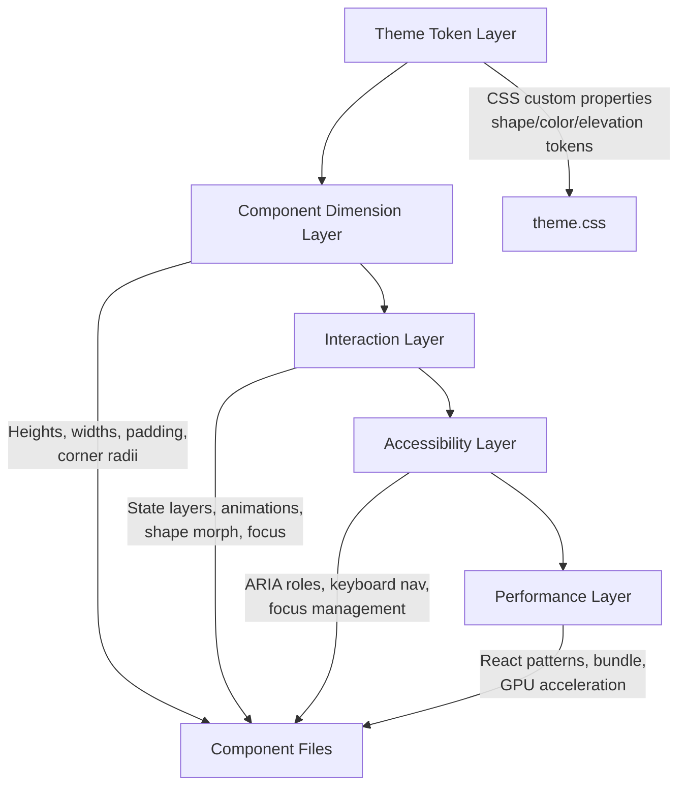
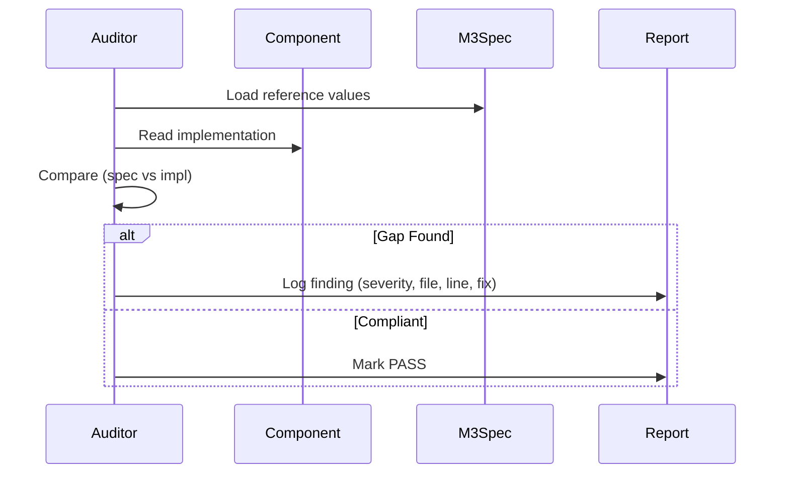

# Design Document: M3 Expressive Production Audit

## Overview

This design document defines the architecture and methodology for a comprehensive M3 Expressive production audit of the `@strata/mui` component library. The audit systematically verifies that all 40+ components conform to the M3 Expressive specification (as documented at [m3.material.io](https://m3.material.io/components)), WCAG 2.1 AA accessibility standards, and production-grade React/Next.js patterns.

The library already implements many M3 Expressive features (5-size scale, shape morph, enhanced motion). This audit validates correctness of existing implementations and identifies remaining gaps.

### Design Decisions

1. **Audit-as-code approach**: Findings are structured as machine-parseable checklists per component, enabling automated tracking.
2. **Severity classification**: Critical (blocks production) > Major (degrades UX) > Minor (polish). Only Critical/Major require remediation before release.
3. **Reference-first methodology**: Every spec value is sourced from m3.material.io with fallback to the Android reference implementation (material-components-android).
4. **Verify, don't redesign**: The library's existing architectural choices (Tailwind v4, CVA, motion/react, Radix primitives) are retained. The audit identifies delta from spec, not alternative architectures.

## Architecture

The audit follows a layered verification approach:



### Audit Execution Flow



## Components and Interfaces

### Audit Module Structure

The audit is organized into verification modules, each producing a structured report:

```typescript
interface AuditFinding {
  component: string;
  category: 'dimension' | 'spacing' | 'shape' | 'elevation' | 'color' | 'state-layer' | 'typography' | 'touch-target' | 'animation' | 'aria' | 'keyboard' | 'focus' | 'motion' | 'theme' | 'performance' | 'nextjs' | 'code-quality' | 'component-gaps';
  severity: 'critical' | 'major' | 'minor';
  description: string;
  specReference: string; // URL or WCAG SC
  filePath: string;
  lineNumber?: number;
  currentValue: string;
  expectedValue: string;
  remediation: string;
}

interface ComponentScorecard {
  component: string;
  filePath: string;
  categories: Record<string, 'pass' | 'fail' | 'n/a'>;
  findings: AuditFinding[];
}

interface AuditReport {
  summary: {
    totalComponents: number;
    critical: number;
    major: number;
    minor: number;
    passRate: number;
  };
  scorecards: ComponentScorecard[];
}
```

### M3 Expressive Reference Values

The following are the canonical M3 Expressive spec values used as the audit baseline. These extend standard M3 with 5-size scales, enhanced shapes, and morph animations.

#### Button Dimensions (M3 Expressive 5-Size Scale)

| Size | Height | Horizontal Padding | Icon Size | Shape (Round) | Shape (Square) | Morph Target |
|------|--------|-------------------|-----------|---------------|----------------|--------------|
| XS   | 32dp   | 12dp              | 18dp      | full (pill)   | 12dp           | 8dp          |
| S    | 36dp   | 16dp              | 18dp      | full (pill)   | 12dp           | 8dp          |
| M    | 40dp   | 24dp              | 20dp      | full (pill)   | 16dp           | 12dp         |
| L    | 48dp   | 28dp              | 24dp      | full (pill)   | 28dp           | 16dp         |
| XL   | 56dp   | 32dp              | 24dp      | full (pill)   | 28dp           | 16dp         |

#### IconButton Dimensions (M3 Expressive 5-Size Scale)

| Size | Container | Icon Size | Shape (Round) | Shape (Square) | Morph Target |
|------|-----------|-----------|---------------|----------------|--------------|
| XS   | 32dp      | 18dp      | full          | 12dp           | 8dp          |
| S    | 40dp      | 20dp      | full          | 12dp           | 8dp          |
| M    | 48dp      | 24dp      | full          | 16dp           | 12dp         |
| L    | 56dp      | 28dp      | full          | 28dp           | 16dp         |
| XL   | 64dp      | 32dp      | full          | 28dp           | 16dp         |

#### FAB Dimensions

| Size    | Container | Icon  | Shape (Rounded) | Shape (Round) | Morph (Rounded) | Morph (Round) |
|---------|-----------|-------|-----------------|---------------|-----------------|---------------|
| M       | 48dp      | 24dp  | 12dp            | full          | 8dp             | 12dp          |
| L       | 56dp      | 24dp  | 16dp            | full          | 12dp            | 16dp          |
| XL      | 96dp      | 36dp  | 28dp            | full          | 20dp            | 28dp          |

#### Form Controls

| Component | Visual Size | Touch Target | Key Dimension |
|-----------|-------------|--------------|---------------|
| Checkbox  | 18×18dp     | 48dp         | 2dp corner radius |
| Radio     | 20dp ⌀      | 48dp         | 2dp border width |
| Switch    | 52×32dp track | 48dp       | Handle: 16dp (off), 24dp (on/icon), 28dp (pressed) |
| Slider    | 16dp track height | 48dp vertical | 8dp radius (fully rounded) |

#### Container Components

| Component       | Height/Size         | Corner Radius | Elevation |
|-----------------|---------------------|---------------|-----------|
| TextField       | 56dp                | 4dp (outlined all), 4dp top (filled) | — |
| NavigationBar   | 64dp                | — | Level 1 |
| Tabs (text)     | 48dp                | — | — |
| Tabs (icon+text)| 64dp                | — | — |
| Dialog          | min 280dp, max 560dp| 28dp | Level 4 |
| Card            | auto                | 12dp | Level 1 (elevated) |
| Chip            | 32dp                | 8dp | — |
| Menu            | 48dp items          | 4dp | Level 3 |
| Snackbar        | min 48dp            | 4dp | Level 3 |
| AppBar          | 64dp                | — | — |
| Search          | 56dp                | full (pill) | — |

#### State Layer Opacities

| State    | Opacity | Color Source |
|----------|---------|--------------|
| Hover    | 8%      | Component's on-color |
| Focus    | 10%     | Component's on-color |
| Press    | 10%     | Component's on-color |
| Drag     | 16%     | Component's on-color |
| Disabled | 38%     | on-surface (entire component) |

#### Elevation Scale

| Level | Shadow Opacity | Usage |
|-------|---------------|-------|
| 1     | 4%            | Card (elevated), AppBar scroll |
| 2     | 6%            | Card hover, elevated button hover |
| 3     | 8%            | FAB rest, Menu, Snackbar |
| 4     | 10%           | FAB hover, Dialog |
| 5     | 12%           | (reserved) |

#### Shape Scale Tokens

| Token      | Value   | Usage |
|------------|---------|-------|
| shape-full | 9999px  | Buttons (round), Search, NavigationBar indicator, Switch track |
| shape-xl   | 28px    | Dialog, BottomSheet (top), FAB XL, Card |
| shape-lg   | 16px    | FAB M (rounded), Card, Button L/XL (square) |
| shape-md   | 12px    | Card, Menu, Chip, Button M (square) |
| shape-sm   | 8px     | Chip, TextField (outlined), Button XS/S (square) |

#### Animation Specifications

| Property | Duration | Easing | Usage |
|----------|----------|--------|-------|
| Standard enter | 200ms | cubic-bezier(0.2, 0, 0, 1) | Dialog, indicator slide, sheet enter |
| Standard exit | 150ms | cubic-bezier(0.4, 0, 1, 1) | Dialog exit, menu exit |
| Shape morph | 100ms | ease-out | Border-radius change on press |
| Menu/tooltip enter | 150ms | ease-out | Menu appear, tooltip fade |
| Scrim | 150ms | cubic-bezier(0.2, 0, 0, 1) | Modal overlay |
| State layer | 200ms | — | Opacity transitions |

#### Typography Scale (M3 Type Scale)

| Role | Size | Weight | Line Height | Letter Spacing |
|------|------|--------|-------------|----------------|
| Display Large | 57px | 400 | 64px | -0.25px |
| Display Medium | 45px | 400 | 52px | 0 |
| Display Small | 36px | 400 | 44px | 0 |
| Headline Large | 32px | 400 | 40px | 0 |
| Headline Medium | 28px | 400 | 36px | 0 |
| Headline Small | 24px | 400 | 32px | 0 |
| Title Large | 22px | 400 | 28px | 0 |
| Title Medium | 16px | 500 | 24px | 0.15px |
| Title Small | 14px | 500 | 20px | 0.1px |
| Body Large | 16px | 400 | 24px | 0.5px |
| Body Medium | 14px | 400 | 20px | 0.25px |
| Body Small | 12px | 400 | 16px | 0.4px |
| Label Large | 14px | 500 | 20px | 0.1px |
| Label Medium | 12px | 500 | 16px | 0.5px |
| Label Small | 11px | 500 | 16px | 0.5px |

## Data Models

### Audit Checklist Data Model

Each component is verified against a structured checklist:

```typescript
interface ComponentAuditChecklist {
  component: string;
  file: string;
  
  dimensions: {
    height: { expected: string; actual: string; pass: boolean };
    width?: { expected: string; actual: string; pass: boolean };
    iconSize?: { expected: string; actual: string; pass: boolean };
    touchTarget?: { expected: string; actual: string; pass: boolean };
  };
  
  spacing: {
    padding: { expected: string; actual: string; pass: boolean };
    gap?: { expected: string; actual: string; pass: boolean };
    margin?: { expected: string; actual: string; pass: boolean };
  };
  
  shape: {
    cornerRadius: { expected: string; actual: string; pass: boolean };
    morphTarget?: { expected: string; actual: string; pass: boolean };
    morphDuration?: { expected: string; actual: string; pass: boolean };
  };
  
  color: {
    background: { expected: string; actual: string; pass: boolean };
    text: { expected: string; actual: string; pass: boolean };
    stateLayerColor: { expected: string; actual: string; pass: boolean };
  };
  
  stateLayer: {
    hover: { expected: '8%'; actual: string; pass: boolean };
    focus: { expected: '10%'; actual: string; pass: boolean };
    press: { expected: '10%'; actual: string; pass: boolean };
    disabled: { expected: '38%'; actual: string; pass: boolean };
  };
  
  animation: {
    easing: { expected: string; actual: string; pass: boolean };
    duration: { expected: string; actual: string; pass: boolean };
    gpuAccelerated: boolean;
  };
  
  accessibility: {
    ariaRole: { expected: string; actual: string; pass: boolean };
    ariaProps: { expected: string[]; actual: string[]; pass: boolean };
    keyboardNav: { expected: string[]; actual: string[]; pass: boolean };
    focusManagement: { pass: boolean; notes: string };
    touchTarget: { expected: '48dp'; actual: string; pass: boolean };
  };
  
  reactPatterns: {
    forwardRef: boolean;
    displayName: boolean;
    useClient: boolean;
    cleanupEffects: boolean;
    memoizedCallbacks: boolean;
    memoizedContext: boolean;
    noInlineObjects: boolean;
  };
}
```

### Remediation Pattern Library

Common fix patterns referenced throughout the audit:

```typescript
interface RemediationPattern {
  id: string;
  title: string;
  category: string;
  description: string;
  before: string; // code snippet
  after: string;  // code snippet
}
```

Key remediation patterns:

1. **STATE_LAYER_PSEUDO** — Implementing state layers via `::before` pseudo-element
2. **TOUCH_TARGET_EXPANDER** — Wrapping small interactive elements in 48dp touch containers
3. **SHAPE_MORPH_ACTIVE** — Adding `active:rounded-{reduced}` for press morph
4. **ARIA_ROLE_ASSIGNMENT** — Adding correct ARIA role and state attributes
5. **FOCUS_TRAP_MODAL** — Implementing keyboard focus trap for modal components
6. **REDUCED_MOTION_RESPECT** — Checking `prefers-reduced-motion` in JS animations
7. **CONTEXT_MEMO** — Wrapping context values in `useMemo` for referential stability
8. **CALLBACK_STABLE** — Wrapping handlers in `useCallback` to prevent re-renders
9. **FORWARD_REF** — Adding `React.forwardRef` to all DOM-rendering components
10. **ELEVATION_DISABLED** — Removing shadows when `disabled` prop is true

## Correctness Properties

*A property is a characteristic or behavior that should hold true across all valid executions of a system — essentially, a formal statement about what the system should do. Properties serve as the bridge between human-readable specifications and machine-verifiable correctness guarantees.*

### Property 1: State Layer Opacity Compliance

*For any* interactive component in the library, the hover state layer SHALL have 8% opacity, the focus state layer SHALL have 10% opacity, and the press/active state layer SHALL have 10% opacity.

**Validates: Requirements 6.1, 6.2, 6.3**

### Property 2: State Layer Implementation Pattern

*For any* interactive component, state layers SHALL be implemented via `::before` pseudo-elements (using Tailwind `before:` prefix classes) and SHALL use `bg-current` (inheriting the component's text/on-color) as the state layer color source.

**Validates: Requirements 6.5, 6.7**

### Property 3: Disabled State Rendering

*For any* interactive component with `disabled=true`, the component SHALL render with 38% opacity (`opacity-[0.38]`) AND include `aria-disabled` attribute AND remove all elevation shadows.

**Validates: Requirements 4.7, 10.11, 19.4**

### Property 4: Shape Morph on Press

*For any* component that supports shape morph (Button, IconButton, FAB, ExtendedFAB), when pressed (`:active`), the border-radius SHALL be reduced by approximately 20-30% from its resting value, using a 100ms ease-out transition.

**Validates: Requirements 3.6, 9.4**

### Property 5: Touch Target Minimum

*For any* interactive component (buttons, checkboxes, radios, switches, sliders, list items), the clickable/tappable area SHALL be at least 48dp (48px) in both width and height, either via direct container sizing or touch-target expander wrappers.

**Validates: Requirements 8.1**

### Property 6: Focus Ring Visibility

*For any* interactive component when focused via keyboard (`focus-visible`), a visible focus ring SHALL be rendered (2px, primary color) using `focus-visible:ring-2 focus-visible:ring-primary` classes.

**Validates: Requirements 12.1**

### Property 7: Typography Scale Accuracy

*For any* of the 15 Typography component variants, the rendered CSS classes SHALL produce the exact font-size, font-weight, line-height, and letter-spacing values defined in the M3 type scale specification.

**Validates: Requirements 7.8**

### Property 8: Button Asymmetric Padding

*For any* Button rendered with a leading icon (and no trailing icon), the icon-side horizontal padding SHALL be less than the opposite-side horizontal padding. Conversely for trailing-only icons.

**Validates: Requirements 2.7**

### Property 9: M3 Standard Easing for Enter Animations

*For any* component with enter/emphasis animations (dialog open, indicator slide, sheet enter), the animation SHALL use the M3 standard easing curve `cubic-bezier(0.2, 0, 0, 1)`.

**Validates: Requirements 9.1**

### Property 10: GPU-Accelerated Animation Properties

*For any* animated component, transitions and animations SHALL only animate `transform`, `opacity`, `background-color` (for state layers), or `box-shadow` — never layout-triggering properties like `width`, `height`, `top`, `left` for performance-critical paths.

**Validates: Requirements 9.6, 16.3**

### Property 11: React forwardRef and displayName

*For any* exported component that renders a DOM element, it SHALL use `React.forwardRef` AND set `ComponentName.displayName` to the component's name string.

**Validates: Requirements 15.3, 17.2, 17.3**

### Property 12: Context Value Memoization

*For any* component that creates a React Context value object, the value SHALL be wrapped in `React.useMemo`. Any callback functions passed through context SHALL be wrapped in `React.useCallback`.

**Validates: Requirements 15.1, 15.2**

### Property 13: Side Effect Cleanup

*For any* component that registers event listeners on `document`, `window`, or creates timers/observers inside `useEffect`, the effect SHALL return a cleanup function that removes/clears them.

**Validates: Requirements 15.6, 17.6**

### Property 14: "use client" Directive

*For any* component file that uses React hooks (`useState`, `useEffect`, `useRef`, `useContext`, etc.) or browser APIs, the file SHALL begin with the `"use client"` directive as its first statement.

**Validates: Requirements 17.1**

### Property 15: Named Exports Only

*For any* component module file, all exports SHALL be named exports (no `export default`), enabling tree-shaking by bundlers.

**Validates: Requirements 16.2**

### Property 16: Controlled/Uncontrolled Pattern Consistency

*For any* form component (TextField, Checkbox, Radio, Switch, Slider, Tabs, Search), the component SHALL support both controlled (`value` + `onChange`/`onValueChange`) and uncontrolled (`defaultValue`/`defaultChecked`) usage patterns, with internal state used only when uncontrolled.

**Validates: Requirements 17.7, 18.7**

### Property 17: TypeScript Interface Export

*For any* component with a public props interface (e.g., `ButtonProps`, `IconButtonProps`), that interface SHALL be exported alongside the component from the module file.

**Validates: Requirements 18.4**

### Property 18: JSDoc with M3 Spec Reference

*For any* component file in the library, a JSDoc comment SHALL be present containing either a `@see` link to the M3 spec URL or inline M3 specification measurements.

**Validates: Requirements 18.1**


## Error Handling

### Audit Error Scenarios

| Scenario | Handling Strategy |
|----------|-------------------|
| Component missing from index exports | Flag as Critical finding — component exists but unreachable |
| Theme token undefined in dark mode | Flag as Critical — dark mode broken for that token |
| ARIA role missing on interactive component | Flag as Critical — accessibility failure |
| Touch target < 48dp without expander | Flag as Major — WCAG 2.5.5 violation |
| Animation not GPU-accelerated | Flag as Minor — performance degradation |
| Missing displayName | Flag as Minor — DevTools debugging impact |
| Incorrect elevation level | Flag as Major — visual hierarchy broken |
| State layer wrong opacity | Flag as Major — interaction feedback incorrect |
| Typography wrong weight/size | Flag as Major — visual consistency broken |
| Missing useCallback/useMemo | Flag as Minor — performance at scale |

### Remediation Error Prevention

When applying fixes, the following guardrails prevent regressions:

1. **No breaking API changes** — All fixes must be backward-compatible. Props can be added but not removed or renamed.
2. **Theme token stability** — CSS custom property names cannot change. Only values can be corrected.
3. **Visual regression safety** — Each remediated component must be visually verified against the docs site.
4. **Accessibility non-regression** — ARIA role changes must be validated against the WAI-ARIA spec to avoid introducing new violations.

## Testing Strategy

### Dual Testing Approach

The audit verification uses two complementary testing strategies:

#### 1. Property-Based Tests (Universal Verification)

Property-based tests verify universal rules that hold across ALL components. These use `fast-check` (or equivalent) to generate random component configurations and verify invariants.

**Configuration:**
- Minimum 100 iterations per property test
- Each test references its design document property number
- Tag format: `Feature: m3-production-audit, Property {N}: {description}`

**Properties suitable for PBT:**
- State layer opacities (Properties 1, 2)
- Disabled state rendering (Property 3)
- Touch target minimums (Property 5)
- Focus ring visibility (Property 6)
- Typography accuracy (Property 7)
- forwardRef/displayName (Property 11)
- "use client" directive (Property 14)
- Named exports (Property 15)
- Controlled/uncontrolled patterns (Property 16)

**PBT Library:** `fast-check` (TypeScript) for generating component prop combinations and verifying rendered output against spec.

#### 2. Example-Based Unit Tests (Specific Verification)

Example-based tests cover specific component measurements, ARIA assignments, and feature completeness checks where the input space is small or deterministic.

**Categories:**
- Dimension verification (height, width, padding per component)
- ARIA role assignment (role, aria-checked, aria-selected per component)
- Keyboard navigation (specific key handlers per component)
- Feature completeness (year picker, carousel variants)
- Theme configuration (token existence, dark mode)

#### 3. Smoke Tests (Configuration Checks)

One-time verification of theme infrastructure:
- All color tokens defined in `:root`
- Dark mode `.dark` overrides complete
- Shape/elevation/state tokens present
- Reduced motion media query present
- Package.json exports correct
- TypeScript strict mode enabled

### Test Organization

```
tests/
├── audit/
│   ├── properties/           # PBT tests (universal invariants)
│   │   ├── state-layer.test.ts
│   │   ├── disabled-state.test.ts
│   │   ├── touch-targets.test.ts
│   │   ├── focus-ring.test.ts
│   │   ├── typography-scale.test.ts
│   │   ├── react-patterns.test.ts
│   │   └── module-hygiene.test.ts
│   ├── dimensions/           # Example-based dimension tests
│   │   ├── button.test.ts
│   │   ├── icon-button.test.ts
│   │   ├── form-controls.test.ts
│   │   └── containers.test.ts
│   ├── accessibility/        # ARIA and keyboard tests
│   │   ├── aria-roles.test.ts
│   │   ├── keyboard-nav.test.ts
│   │   └── focus-management.test.ts
│   └── smoke/                # Configuration/theme checks
│       ├── theme-tokens.test.ts
│       ├── package-config.test.ts
│       └── reduced-motion.test.ts
```

### Audit Report Generation

The audit produces a structured JSON report that can be rendered as:
1. **Markdown summary** — Per-component scorecard table
2. **CI/CD gate** — Pass/fail based on zero Critical findings
3. **Remediation tracker** — Ordered by severity → component → category

### Verification Criteria for Audit Completion

The audit is considered complete when:
- [ ] All 40+ components have been individually verified
- [ ] Zero Critical findings remain
- [ ] All Major findings have documented remediation plans
- [ ] Theme token architecture verified for light + dark modes
- [ ] All ARIA roles verified against WAI-ARIA 1.2 spec
- [ ] All keyboard navigation patterns verified
- [ ] All animations verified for GPU acceleration
- [ ] Reduced motion support verified globally
- [ ] TypeScript compilation passes with strict mode
- [ ] All property-based tests pass (100+ iterations each)
